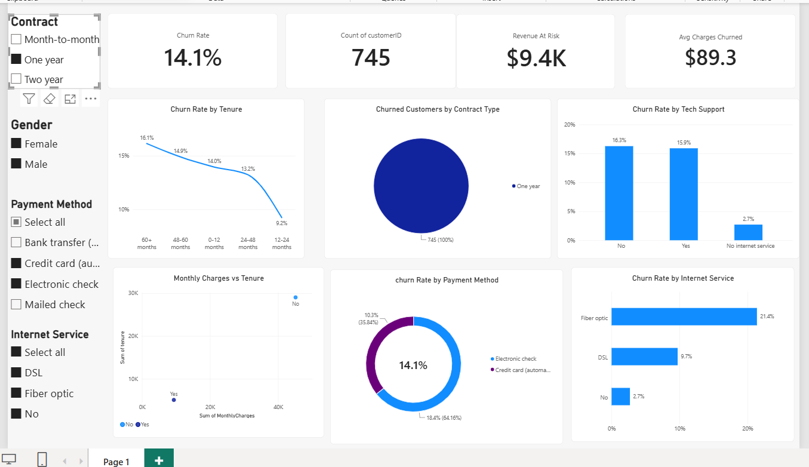

# Telecom Customer Churn Analysis

Customer churn analysis for a telecom company using SQL, Python, and Power BI to identify retention drivers and quantify revenue at risk.

## Business Question

Which customers are most likely to churn, and what actionable steps could reduce churn and protect revenue?

## Tools Used

- **Python (Pandas)** — data cleaning, feature engineering, exploratory analysis
- **SQL (MySQL)** — aggregation queries for churn segmentation
- **Power BI** — interactive dashboard for stakeholders

## Dataset

[Telco Customer Churn dataset](https://www.kaggle.com/datasets/blastchar/telco-customer-churn) — 7,043 customers, 21 attributes including demographics, account details, subscribed services, and churn status.

## Process

1. **Data Cleaning (Python):** Fixed 11 records with blank `TotalCharges` values (all new customers with 0 tenure), converted the column to a proper numeric type, and engineered a `TenureGroup` feature to bucket customers by loyalty stage.
2. **SQL Analysis (MySQL):** Wrote aggregation queries to segment churn rate by contract type, tenure, payment method, tech support, online security, and internet service — see `sql/churn_analysis_queries.sql`.
3. **Dashboard (Power BI):** Built an interactive one-page dashboard with KPI cards, six visuals, and four slicers so stakeholders can filter live by contract, gender, internet service, and payment method.

## Key Findings

- **Overall churn rate is 26.5%** (1,869 of 7,043 customers).
- **Contract type is the single strongest churn driver.** Month-to-month customers churn at 42.7%, versus 11.3% for one-year and just 2.8% for two-year contracts — a 15x spread.
- **New customers are the highest risk.** Customers in their first 12 months churn at 47.4%, dropping steadily to 6.6% for customers with 5+ years of tenure.
- **Payment method matters more than expected.** Electronic check users churn at 45.3%, nearly 3x the rate of customers on automatic bank transfer or credit card payments (~15-17%). Manual, recurring-effort payments appear to correlate with lower engagement and higher attrition.
- **Missing add-on services nearly triple churn risk.** Customers without Tech Support churn at 41.6% vs. 15.2% with it; customers without Online Security churn at 41.8% vs. 14.6% with it.
- **Churned customers pay more on average** ($74.44/month vs. $61.27/month for retained customers), and Fiber optic subscribers churn at nearly double the rate of DSL customers (41.9% vs. 19.0%).

## Recommendations

- Prioritize retention outreach for month-to-month, low-tenure customers — the highest-risk segment by a wide margin.
- Encourage migration from Electronic check to automatic payment methods, which correlate with substantially lower churn.
- Proactively offer Tech Support and Online Security add-ons to at-risk segments; both show a strong protective effect against churn.

## Dashboard



## Repository Structure

```
telecom-customer-churn-analysis/
├── data/
│   ├── telco_churn_raw.csv
│   └── telco_churn_cleaned.csv
├── notebooks/
│   └── churn_analysis.ipynb
├── sql/
│   └── churn_analysis_queries.sql
├── dashboard/
│   ├── telecom_churn_dashboard.pbix
│   └── dashboard_screenshot.png
└── README.md
```

## How to Run

1. Clone this repository
2. Open `notebooks/churn_analysis.ipynb` in Jupyter to reproduce the data cleaning and Python analysis
3. Run `sql/churn_analysis_queries.sql` against a MySQL instance with the cleaned dataset imported as `telco_churn_cleaned`
4. Open `dashboard/telecom_churn_dashboard.pbix` in Power BI Desktop to explore the interactive dashboard

---
Built by [bharath-analytics18](https://github.com/bharath-analytics18)
